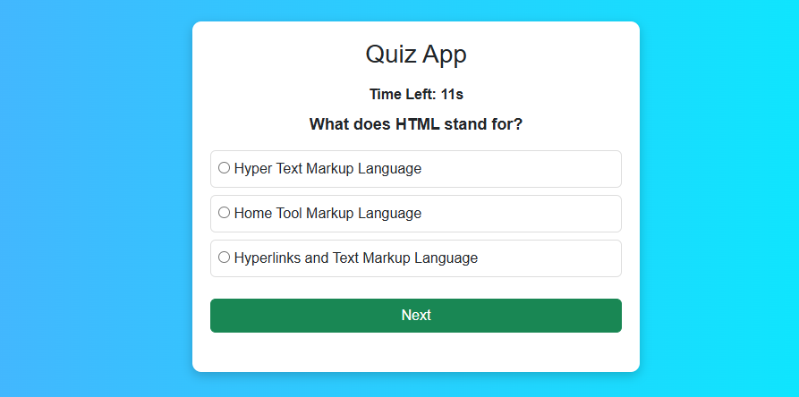
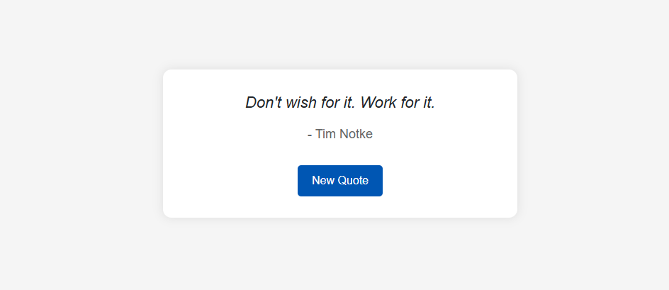
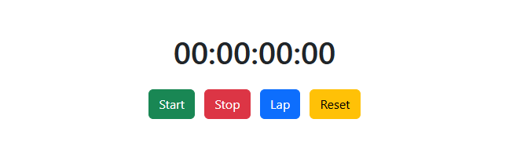

# JavaScript Mini Projects Collection

This repository contains **three beginner-to-intermediate JavaScript projects**, each focusing on different concepts of HTML, CSS, and JavaScript.  
These projects are built without heavy external libraries (except Bootstrap for styling where needed) and are aimed at practicing DOM manipulation, event handling, and basic logic building.

---

## 📂 Projects Overview

### 1️⃣ Download Progress Bar
A simple yet visually appealing progress bar that fills from **0% to 100%**, simulating a file download process.  
The percentage text is displayed **centered inside the bar** for better UX.

**Features:**
- Smooth progress animation.
- Percentage count displayed inside the bar.
- Responsive layout.

**Tech Stack:**
- HTML
- CSS
- JavaScript

---

### 2️⃣ Quotes Generator App
A minimal quotes application that displays random quotes on button click.  
Built for practicing **JavaScript array handling** and **DOM updates**.

**Features:**
- Generates a new quote every time you click the button.
- Clean and lightweight UI.
- Easy to add more quotes.

**Tech Stack:**
- HTML
- CSS
- JavaScript

---

### 3️⃣ Stopwatch
A digital stopwatch capable of tracking hours, minutes, seconds, and milliseconds.  
Designed for **time-based events** and **JavaScript timers** practice.

**Features:**
- Start, Pause, and Reset controls.
- Accurate time tracking using `setInterval`.
- Well-aligned display.

**Tech Stack:**
- HTML
- CSS
- JavaScript

---

## 🚀 Getting Started

1. **Clone the repository**
   ```bash
   git clone https://github.com/your-username/js-mini-projects.git
   cd js-mini-projects
   ```

2. **Open the project**
   - Navigate to any project folder.
   - Open the `.html` file in your browser.

---

## 📸 Screenshots & Live Demos

> Click the names to view the live project (via GitHub Pages).  
> **[View Github Profile](https://github.com/parmarkrishnaa/Pr-6-Countdown)**

- **[Download Progress Bar](https://github.com/parmarkrishnaa/Pr-6-Countdown/blob/main/Progress-Bar/index.html)**  
  

- **[Quiz App](https://github.com/parmarkrishnaa/Pr-6-Countdown/blob/main/Quiz-App/index.html)**  
  

- **[Quotes App](https://github.com/parmarkrishnaa/Pr-6-Countdown/blob/main/Quotes-App/index.html)**  
  

- **[Stopwatch](https://github.com/parmarkrishnaa/Pr-6-Countdown/blob/main/Timer/index.html)**  
  


## 📚 Learning Outcomes
- DOM Manipulation in JavaScript.
- Working with timers (`setInterval`, `setTimeout`).
- Styling with CSS for responsive designs.
- Event-driven programming in JavaScript.

---

## 🛠 Future Improvements
- Add local storage support for Quotes App.
- Allow theme customization for Stopwatch.
- Add a real file download simulation for Progress Bar.

---

## 📄 License
This project is open-source and available under the [MIT License](LICENSE).

---
